# envpack

A collection of classic game environments for Gymnasium.

[](https://github.com/psf/black)

## Installation

To install the environments, you can use pip:

```bash
pip install git+https://github.com/rax85/envpack.git
```

## Usage

```python
import gymnasium as gym
import envpack

# To run 2048
env = gym.make('envpack/2048-v0')

# To run Snake
# env = gym.make('envpack/Snake-v0')

# To run Tetris
# env = gym.make('envpack/Tetris-v0')

# To run Sudoku
# env = gym.make('envpack/Sudoku-v0')

# To run Raptor
# env = gym.make('envpack/Raptor-v0')

# To run Checkers
# env = gym.make('envpack/Checkers-v0')

# To run Tron
# env = gym.make('envpack/Tron-v0')

# To run Air Hockey
# env = gym.make('envpack/AirHockey-v0')

# To run Racing
# env = gym.make('envpack/Racing-v0')

# To run Doom
# env = gym.make('envpack/Doom-v0')

# To run Paratrooper
# env = gym.make('envpack/Paratrooper-v0')

# To run Street Fighter
# env = gym.make('envpack/StreetFighter-v0')

# To run Tank Combat
# env = gym.make('envpack/TankCombat-v0')

# To run Gravity Duel
# env = gym.make('envpack/GravityDuel-v0')

# To run Artillery Forts
# env = gym.make('envpack/ArtilleryForts-v0')

observation, info = env.reset()
done = False

while not done:
    action = env.action_space.sample()  # Take a random action
    observation, reward, terminated, truncated, info = env.step(action)
    done = terminated or truncated

env.close()
```

---

## Game Environments

## 👤 Single Player Games

### 1. 2048 (`envpack/2048-v0`)

A Gymnasium environment for the classic 2048 tile-merging game played on a 4x4 grid.

*   **Action Space**: `Discrete(4)`:
    *   `0`: Up, `1`: Down, `2`: Left, `3`: Right
*   **Observation Space**: `Dict` containing:
    *   `'observation'`: `Box(4, 4)` representing tile values.
    *   `'valid_mask'`: `Box(4,)` binary mask of valid moves.
    *   `'total_score'`: `Box(1,)` representing the accumulated score.
*   **Rewards**: Sum of merged tile values. Invalid moves yield `-32`.
*   **Screenshots**:

| State | Visual |
| :---: | :---: |
| **Initial State** | 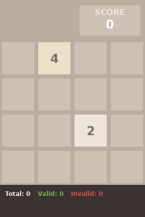 |
| **Mid-game** | 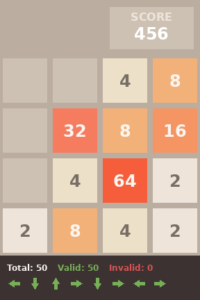 |
| **Game Over** | 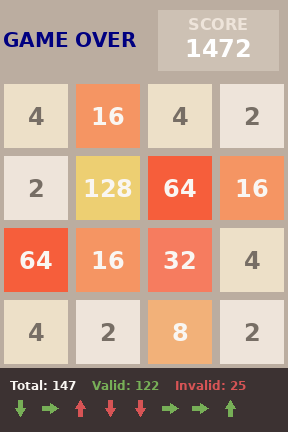 |

### 2. Snake (`envpack/Snake-v0`)

A Gymnasium environment for the classic Snake game played on a 10x10 grid.

*   **Action Space**: `Discrete(4)`:
    *   `0`: Up, `1`: Down, `2`: Left, `3`: Right
*   **Observation Space**: `Dict` containing:
    *   `'observation'`: `Box(10, 10)` representing the board (0: empty, 1: food, 2: snake head, 3: snake body).
    *   `'valid_mask'`: `Box(4,)` binary mask of valid moves (direct backward folding is masked out).
    *   `'total_score'`: `Box(1,)` representing the number of food items eaten.
*   **Rewards**: `+1.0` for eating food, `-0.01` step penalty, and `-1.0` for wall/self collision.
*   **Screenshots**:

| State | Visual |
| :---: | :---: |
| **Initial State** | 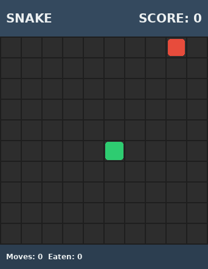 |
| **Mid-game** | 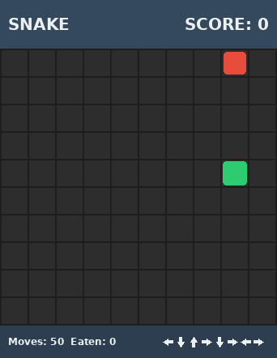 |
| **Game Over** | 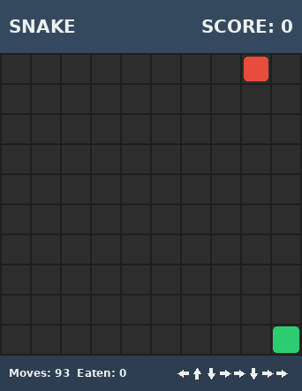 |

### 3. Tetris (`envpack/Tetris-v0`)

A Gymnasium environment for the classic Tetris block-falling puzzle game played on a 10x20 grid.

*   **Action Space**: `Discrete(5)`:
    *   `0`: Move Left, `1`: Move Right, `2`: Rotate Clockwise, `3`: Soft Drop (Down 1), `4`: Hard Drop (Instant drop & lock)
*   **Observation Space**: `Dict` containing:
    *   `'observation'`: `Box(20, 10)` representing the board (0: empty, 1..7: landed tetromino blocks, 8: active falling piece blocks).
    *   `'valid_mask'`: `Box(5,)` binary mask of valid actions.
    *   `'total_score'`: `Box(1,)` representing the accumulated score.
*   **Rewards**: Small survival reward of `+0.01` per step. Clearing lines yields: `0.1` (1 line), `0.3` (2 lines), `0.5` (3 lines), `1.0` (4 lines). Game over yields `-1.0`.
*   **Screenshots**:

| State | Visual |
| :---: | :---: |
| **Initial State** | 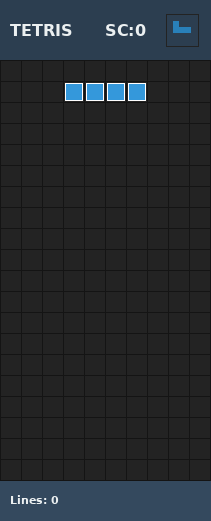 |
| **Mid-game** | 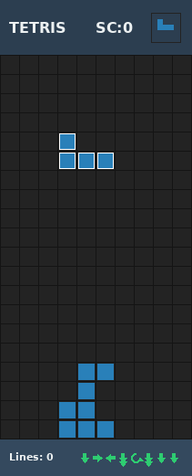 |
| **Game Over** | 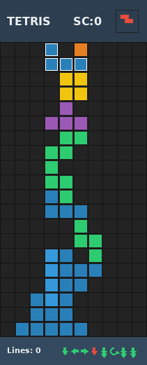 |

### 4. Sudoku (`envpack/Sudoku-v0`)

A Gymnasium environment for solving standard 9x9 Sudoku puzzles.

*   **Action Space**: `MultiDiscrete([9, 9, 10])`:
    *   `row` in `[0..8]`: Target row coordinate to edit.
    *   `col` in `[0..8]`: Target column coordinate to edit.
    *   `value` in `[0..9]`: Digit to place (`1..9`), or `0` to clear/delete the digit.
*   **Observation Space**: `Dict` containing:
    *   `'observation'`: `Box(9, 9)` representing current cell digits.
    *   `'given_mask'`: `Box(9, 9)` representing fixed clues (1 if given clue, 0 if editable).
    *   `'valid_mask'`: `Box(9, 9, 10)` representing safe (conflict-free) digits that can be placed in each cell.
    *   `'total_score'`: `Box(1,)` representing number of cells matching target solution.
*   **Rewards**: `+1.0` for placing a correct digit, `-1.0` for removing/replacing a correct digit, `-0.1` for constraint conflict violations, and `-0.01` step penalty. Completion yields a `+10.0` bonus.
*   **Screenshots**:

| State | Visual |
| :---: | :---: |
| **Initial State** | 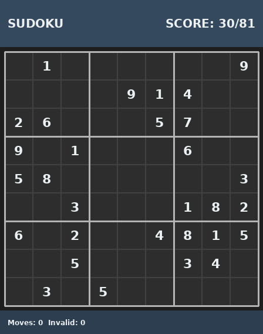 |
| **Mid-game** | 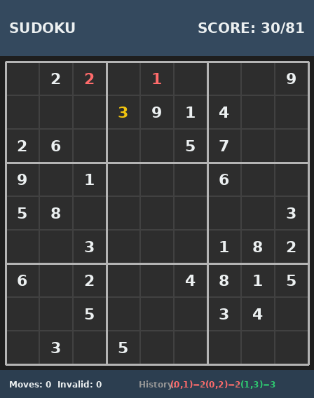 |
| **Solved State** | 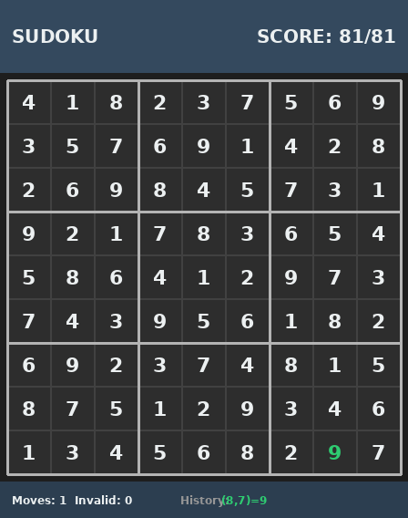 |

### 5. Raptor (`envpack/Raptor-v0`)

A Gymnasium environment for a classic vertical scrolling shooter game inspired by Raptor: Call of the Shadows.

*   **Action Space**: `Discrete(5)`:
    *   `0`: Stay, `1`: Move Left, `2`: Move Right, `3`: Move Up, `4`: Move Down (ship boundaries are limited to the lower half of the screen)
*   **Observation Space**: `Dict` containing:
    *   `'observation'`: `Box(20, 15)` representing the grid (0: empty, 1: player ship, 2: player laser, 3: basic enemy, 4: shooter enemy, 5: enemy bullet, 6: coin).
    *   `'valid_mask'`: `Box(5,)` binary mask of valid movements.
    *   `'total_score'`: `Box(1,)` representing the accumulated score.
    *   `'shield'`: `Box(1,)` representing the player's shield health level `[0..100]`.
*   **Rewards**: Survival reward of `+0.05` per step. Destroying a basic enemy yields `+1.0` (score +100), destroying a shooter enemy yields `+2.5` (score +250). Collecting gold coins yields `+2.0` (score +500, credits +$50). Taking damage from enemy bullets yields `-1.5` (-10% shield), taking damage from direct ship collisions yields `-5.0` (-30% shield). Dying yields `-10.0` death penalty and terminates the episode.
*   **Screenshots**:

| State | Visual |
| :---: | :---: |
| **Initial State** | 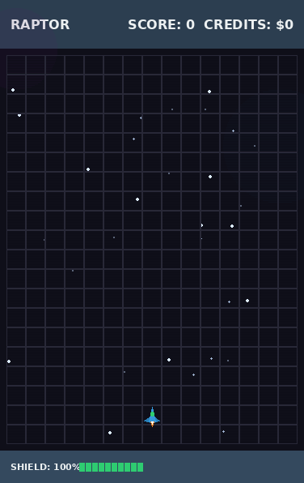 |
| **Mid-game** | 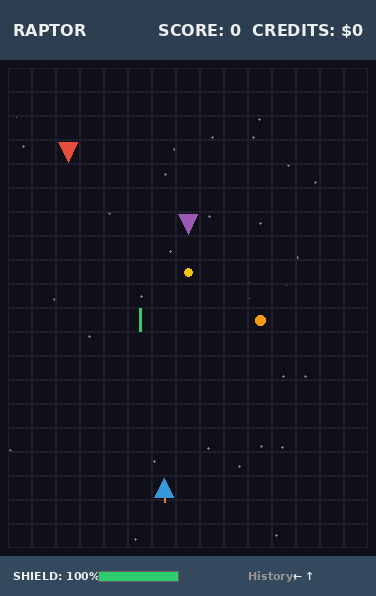 |
| **Game Over** | 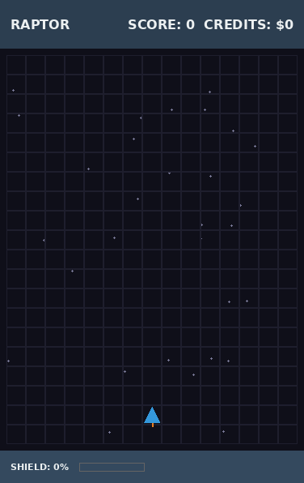 |

### 6. Doom (`envpack/Doom-v0`)

A pseudo-3D first-person shooter Gymnasium environment using JIT-accelerated raycasting.

*   **Action Space**: `Discrete(5)`:
    *   `0`: Turn Left, `1`: Turn Right, `2`: Move Forward, `3`: Move Backward, `4`: Shoot
*   **Observation Space**: `Dict` containing:
    *   `'observation'`: `Box(240, 320, 3)` representing the first-person 3D raycasted view.
    *   `'valid_mask'`: `Box(5,)` binary mask of valid actions.
    *   `'health'`: `Box(1,)` representing the player's health `[0..100]`.
    *   `'ammo'`: `Box(1,)` representing the player's remaining ammunition `[0..99]`.
    *   `'score'`: `Box(1,)` representing the current score (kills).
*   **Rewards**:
    *   Small step penalty of `-0.01`.
    *   Defeating an enemy yields `+10.0` (score +100), hitting an enemy yields `+2.0`.
    *   Picking up health/ammo packs yields `+2.0`.
    *   Getting hit by an enemy yields `-1.0`.
    *   Clearing all enemies (victory) yields `+20.0`.
    *   Dying yields `-10.0`.
*   **Screenshots**:

| State | Visual |
| :---: | :---: |
| **Initial State** | 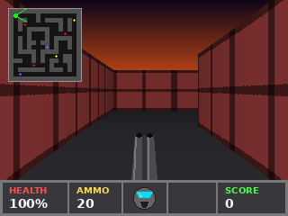 |
| **Mid-game** | 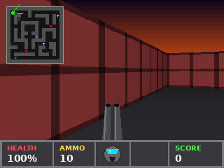 |
| **Game Over** | 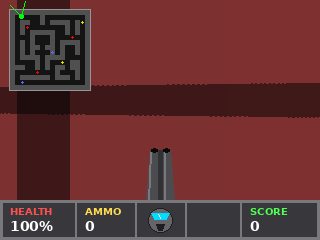 |

### 7. Paratrooper (`envpack/Paratrooper-v0`)

A Gymnasium environment for the classic DOS-style Paratrooper arcade game.

*   **Action Space**: `Discrete(4)`:
    *   `0`: Turn Left, `1`: Turn Right, `2`: Shoot, `3`: Stay
*   **Observation Space**: `Dict` containing:
    *   `'observation'`: `Box(300, 400, 3)` representing the screen view.
    *   `'valid_mask'`: `Box(4,)` binary mask of valid actions.
    *   `'score'`: `Box(1,)` representing the accumulated score.
    *   `'landed_left'`: `Box(1,)` representing the number of paratroopers landed on the left side `[0..4]`.
    *   `'landed_right'`: `Box(1,)` representing the number of paratroopers landed on the right side `[0..4]`.
*   **Rewards**:
    *   Shooting a helicopter: `+10.0` (score +10)
    *   Shooting a paratrooper body: `+5.0` (score +5)
    *   Shooting a parachute canopy: `+0.0` (score +0, but they fall fast and splat)
    *   Shooting a bomb: `+15.0` (score +15)
    *   Firing penalty: `-0.01` to discourage infinite shooting
    *   Game over (turret destroyed by bomb or paratroopers): `-50.0`
*   **Screenshots**:

| State | Visual |
| :---: | :---: |
| **Initial State** | 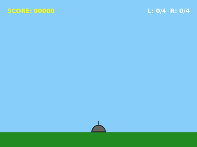 |
| **Mid-game** | 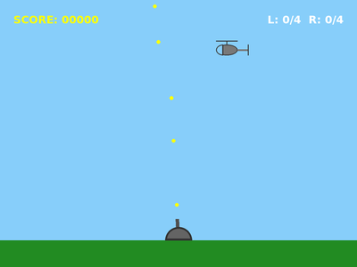 |
| **Game Over** | 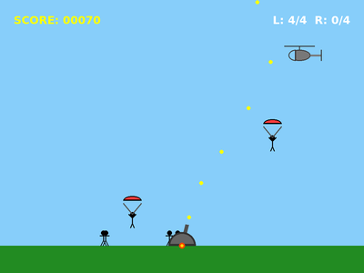 |

---

## 👥 Two Player Games

### 1. Checkers (`envpack/Checkers-v0`)

A Gymnasium environment for two-player American Checkers (Draughts) played on an 8x8 checkerboard.

*   **Action Space**: `MultiDiscrete([8, 8, 8, 8])`:
    *   `[from_row, from_col, to_row, to_col]` representing starting and landing squares.
*   **Observation Space**: `Dict` containing:
    *   `'observation'`: `Box(8, 8)` representing the board (0: empty, 1: P1 normal, 2: P1 king, 3: P2 normal, 4: P2 king).
    *   `'valid_mask'`: `Box(8, 8, 8, 8)` representing binary validity of moves.
    *   `'current_player'`: `Discrete(3)` (1 or 2).
*   **Rewards**: Zero-sum rewards from **Player 1's perspective**:
    *   `+1.0` when Player 1 captures a Player 2 piece (and `-1.0` when Player 2 captures).
    *   `+0.5` when Player 1 promotes a piece to King (and `-0.5` when Player 2 promotes).
    *   `+10.0` when Player 1 wins the game (and `-10.0` when Player 2 wins).
    *   Invalid action attempts yield `-0.1` penalty, and steps have a small `-0.01` penalty.
*   **Stalemate & Multi-jumps**:
    *   Standard American Checkers rules apply: jump captures are mandatory. If a multi-jump is available, the active jumper piece must continue jumping and the turn does not switch.
*   **Screenshots**:

| State | Visual |
| :---: | :---: |
| **Initial State** | 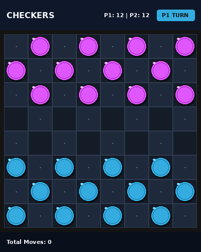 |
| **Mid-game** | 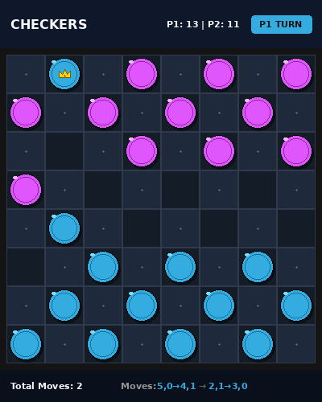 |
| **Game Over** | 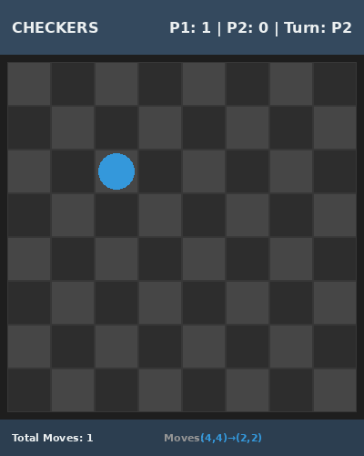 |

### 2. Tron Light Cycles (`envpack/Tron-v0`)

A Gymnasium environment for two-player simultaneous-move Tron Light Cycles played on a 30x30 grid.

*   **Action Space**: `MultiDiscrete([4, 4])`:
    *   `action[0]`: Player 1 action (`0`: Up, `1`: Down, `2`: Left, `3`: Right)
    *   `action[1]`: Player 2 action (`0`: Up, `1`: Down, `2`: Left, `3`: Right)
*   **Observation Space**: `Dict` containing:
    *   `'observation'`: `Box(30, 30)` representing the grid (0: empty, 1: P1 Head, 2: P1 Trail, 3: P2 Head, 4: P2 Trail).
    *   `'valid_mask'`: `Box(2, 4)` representing binary validity of moves (direct opposite turns are masked out).
    *   `'total_score'`: `Box(2,)` representing wins for P1 and P2.
*   **Rewards**: Zero-sum outcome rewards:
    *   `+10.0` when Player 1 wins (Player 2 crashed).
    *   `-10.0` when Player 2 wins (Player 1 crashed).
    *   `0.0` for a head-on collision or joint crash (draw).
    *   `+0.01` survival reward per step for both players (net zero-sum is preserved).
*   **Screenshots**:

| State | Visual |
| :---: | :---: |
| **Initial State** | 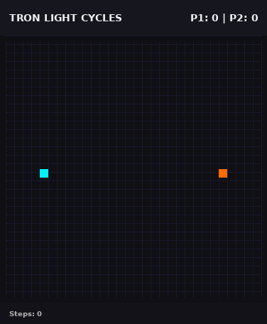 |
| **Mid-game** | 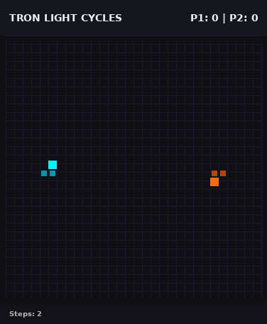 |
| **Game Over** | 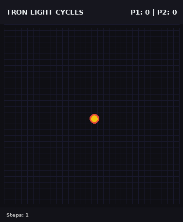 |

### 3. Air Hockey (`envpack/AirHockey-v0`)

A Gymnasium environment for two-player continuous 2D physics-based Air Hockey.

*   **Action Space**: `Box(low=-1.0, high=1.0, shape=(2, 2))` representing:
    *   `action[0]`: Player 1 mallet acceleration/displacement `[dx, dy]`.
    *   `action[1]`: Player 2 mallet acceleration/displacement `[dx, dy]`.
*   **Observation Space**: `Dict` containing:
    *   `'observation'`: `Box(12,)` representing normalized coordinates and velocities:
        *   `[p1_x, p1_y, p1_vx, p1_vy, p2_x, p2_y, p2_vx, p2_vy, puck_x, puck_y, puck_vx, puck_vy]`.
    *   `'total_score'`: `Box(2,)` representing goals scored.
*   **Rewards**:
    *   `+1.0` when Player 1 scores in Player 2's goal (and `-1.0` when Player 2 scores).
    *   `+10.0` win bonus when Player 1 reaches 7 goals (and `-10.0` loss penalty when Player 2 reaches 7).
*   **Screenshots**:

| State | Visual |
| :---: | :---: |
| **Initial State** | 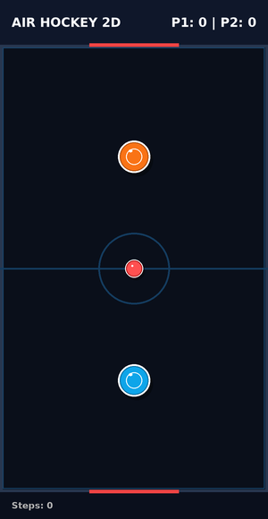 |
| **Mid-game** | 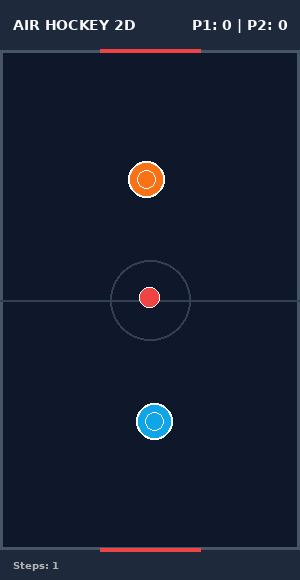 |
| **Game Over** | 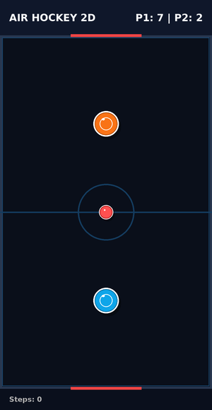 |

### 4. Racing Duel (`envpack/Racing-v0`)

A Gymnasium environment for two-player simultaneous manual-transmission car racing with procedural racetracks and realistic RWD physics.

*   **Action Space**: `Dict` containing:
    *   `'p1_steer_throttle'`: `Box(low=[-1.0, -1.0], high=[1.0, 1.0], shape=(2,), dtype=np.float32)` where `action[0]` is steering (`-1.0` Left to `1.0` Right), and `action[1]` is throttle/brake (`-1.0` Full brake to `1.0` Full throttle).
    *   `'p1_gear'`: `Discrete(3)` gear shift selector (`0`: Hold, `1`: Shift down, `2`: Shift up).
    *   `'p2_steer_throttle'`: `Box(low=[-1.0, -1.0], high=[1.0, 1.0], shape=(2,), dtype=np.float32)`.
    *   `'p2_gear'`: `Discrete(3)`.
*   **Observation Space**: `Dict` containing:
    *   `'observation'`: `Box(16,)` containing:
        *   `[x, y, vx, vy, heading, gear, rpm, progress]` for both Player 1 and Player 2 (all normalized).
    *   `'total_score'`: `Box(2,)` representing lap wins.
*   **Engine & Gearbox**:
    *   6-speed manual gearbox with real gear ratios. Torque curve peaks at 550 Nm between 1850 and 5800 RPM. Redline starts at 7200 RPM. Exceeding redline limits power and triggers overrev engine drag.
    *   Features automated clutch-slipping launch assist below 800 RPM to prevent engine stalling.
*   **RWD Slip Dynamics**:
    *   Realistic lateral tire slip (Pacejka/bicycle models). High throttle inputs consume tire traction circles, causing the rear wheels to lose traction, slide sideways, and trigger oversteer drifting.
*   **Procedural Track spline**:
    *   Cubic spline loops are generated on reset. Going off-track (onto grass) drops the tire grip coefficient from 1.0 to 0.4 and penalizes the vehicle.
*   **Screenshots**:

| State | Visual |
| :---: | :---: |
| **Initial State** |  |
| **Mid-game** | 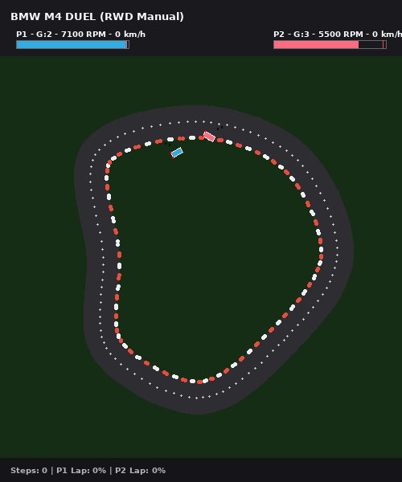 |
| **Game Over** | 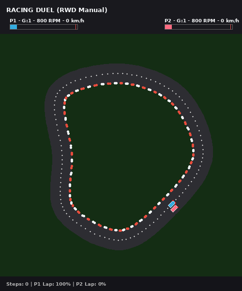 |

### 5. Street Fighter (`envpack/StreetFighter-v0`)

A Gymnasium environment for a simultaneous 2-player Street Fighter-style fighting game.

*   **Action Space**: `MultiDiscrete([8, 8])` representing:
    *   `action[0]`: Player 1 (Ryu) action.
    *   `action[1]`: Player 2 (Ken) action.
    *   Actions: `0`: IDLE, `1`: WALK_LEFT, `2`: WALK_RIGHT, `3`: JUMP, `4`: CROUCH, `5`: PUNCH, `6`: KICK, `7`: SPECIAL_FIREBALL
*   **Observation Space**: `Dict` containing:
    *   `'observation'`: `Box(300, 400, 3)` representing the RGB screen view.
    *   `'valid_mask'`: `Box(2, 8)` binary mask of valid actions.
    *   `'health'`: `Box(2,)` representing players' health `[0..100]`.
    *   `'total_score'`: `Box(2,)` representing wins for Ryu and Ken.
*   **Combat Mechanics**:
    *   **PUNCH**: reach 25, damage 5, hitstun 8 steps.
    *   **KICK**: reach 35, damage 8, hitstun 12 steps.
    *   **SPECIAL_FIREBALL**: projects a projectile (cyan for Ryu, orange for Ken) moving at speed 5. Deals 10 damage. Fireballs cancel each other out on collision.
    *   **Blocking**: holding backward relative to opponent (moving away) or crouching and holding backward blocks incoming high/low attacks, reducing damage to 0 and preventing hitstun.
    *   **Combos**: consecutive hits within 15 steps increment the combo counter, shown on screen (e.g. "3 HIT COMBO!").
    *   **Match Rules**: first to 2 round wins wins the match.
*   **Screenshots**:

| State | Visual |
| :---: | :---: |
| **Initial State** | 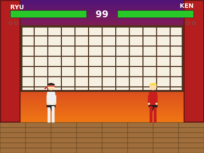 |
| **Mid-game** | 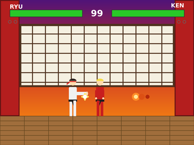 |
| **Game Over** | 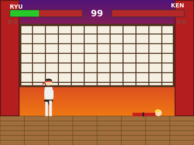 |

### 6. Tank Combat (`envpack/TankCombat-v0`)

A Gymnasium environment for two-player simultaneous Tank Combat in a grid maze.

*   **Action Space**: `MultiDiscrete([5, 5])` representing:
    *   `action[0]`: Player 1 action.
    *   `action[1]`: Player 2 action.
    *   Actions: `0`: IDLE, `1`: Rotate Left, `2`: Rotate Right, `3`: Move Forward, `4`: Shoot.
*   **Observation Space**: `Dict` containing:
    *   `'observation'`: `Box(18,)` vector representing coordinates and velocities:
        *   `[p1_x, p1_y, cos(p1_angle), sin(p1_angle), p1_hp, p2_x, p2_y, cos(p2_angle), sin(p2_angle), p2_hp, b1_x, b1_y, b1_vx, b1_vy, b2_x, b2_y, b2_vx, b2_vy]`.
    *   `'total_score'`: `Box(2,)` representing match score (wins).
*   **Combat Mechanics**:
    *   **Movement**: Sliding wall collision in a 10x10 maze grid.
    *   **Bullets**: sub-step precision, bounce off walls up to 2 times, deal 1 damage to tanks on hit. Respawn on HP depletion.
    *   **HP**: Max 3 HP, drawn as heart HUD symbols. First to 5 wins the match.
*   **Screenshots**:

| State | Visual |
| :---: | :---: |
| **Initial State** | 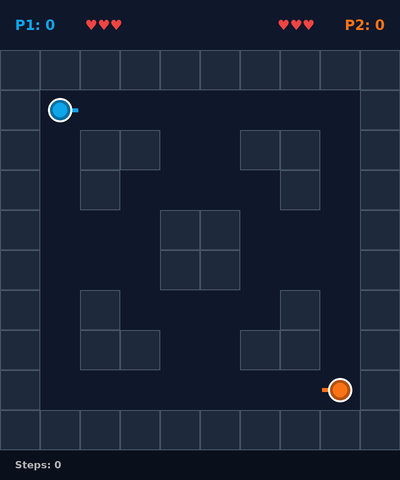 |
| **Mid-game** | 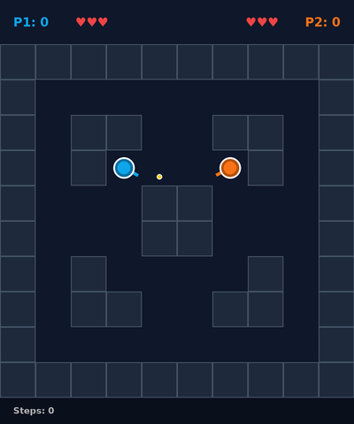 |
| **Game Over** | 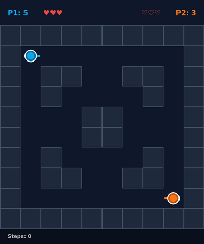 |

### 7. Gravity Duel (`envpack/GravityDuel-v0`)

A Gymnasium environment for two-player continuous Gravity Duel with a central gravity star.

*   **Action Space**: `MultiDiscrete([5, 5])` representing:
    *   `action[0]`: Player 1 action.
    *   `action[1]`: Player 2 action.
    *   Actions: `0`: IDLE, `1`: Rotate Left, `2`: Rotate Right, `3`: Thrust, `4`: Fire Missile.
*   **Observation Space**: `Dict` containing:
    *   `'observation'`: `Box(24,)` representing:
        *   `[p1_x, p1_y, p1_vx, p1_vy, cos(p1_angle), sin(p1_angle), p1_hp, p2_x, p2_y, p2_vx, p2_vy, cos(p2_angle), sin(p2_angle), p2_hp, star_x, star_y, m1_x, m1_y, m1_vx, m1_vy, m2_x, m2_y, m2_vx, m2_vy]`.
    *   `'total_score'`: `Box(2,)` representing match score (wins).
*   **Combat & Gravity Mechanics**:
    *   **Newtonian Thrusters**: Inertial sliding and thrust velocity vectors.
    *   **Warp Wrap-around**: Ships wrap around boundaries on all screen edges.
    *   **Concentric Star Gravity**: A massive sun in the center pulls ships and missiles with $1/r^2$ gravity. Colliding with the sun instantly absorbs/destroys the ship.
*   **Screenshots**:

| State | Visual |
| :---: | :---: |
| **Initial State** | 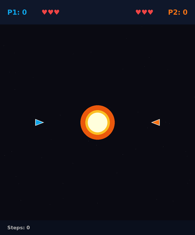 |
| **Mid-game** | 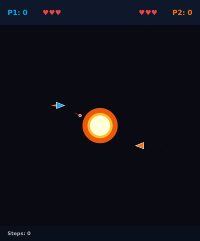 |
| **Game Over** |  |

### 8. Artillery Forts (`envpack/ArtilleryForts-v0`)

A Gymnasium environment for two-player simultaneous real-time Artillery Forts.

*   **Action Space**: `MultiDiscrete([6, 6])` representing:
    *   `action[0]`: Player 1 action.
    *   `action[1]`: Player 2 action.
    *   Actions: `0`: IDLE, `1`: Aim Up, `2`: Aim Down, `3`: Power Up, `4`: Power Down, `5`: Fire.
*   **Observation Space**: `Dict` containing:
    *   `'observation'`: `Box(49,)` containing:
        *   `[p1_y, p1_angle, p1_power, p1_hp, p1_cooldown, p2_y, p2_angle, p2_power, p2_hp, p2_cooldown, wind, s1_x, s1_y, s1_vx, s1_vy, s2_x, s2_y, s2_vx, s2_vy]` and 30 sampled terrain heights.
    *   `'total_score'`: `Box(2,)` representing wins.
*   **Artillery & Cratering Mechanics**:
    *   **Wind Resistance**: Horizontal wind vectors alter trajectory paths.
    *   **Procedural Crater Cratering**: Shell impacts explode and excavate terrain, creating circular holes in the mountain line.
    *   **Dynamic Landslide Fall**: Forts fall vertically down if their supporting terrain is cleared.
*   **Screenshots**:

| State | Visual |
| :---: | :---: |
| **Initial State** | 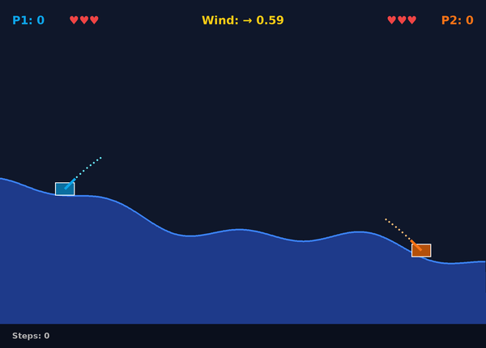 |
| **Mid-game** | 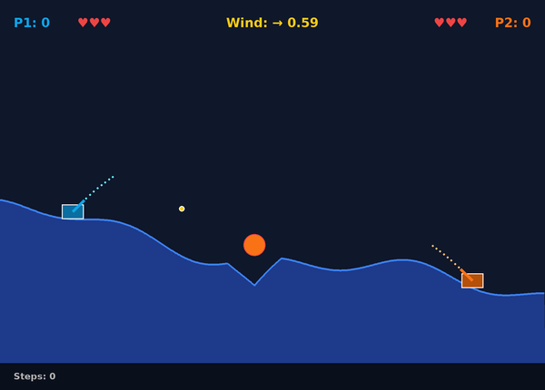 |
| **Game Over** | 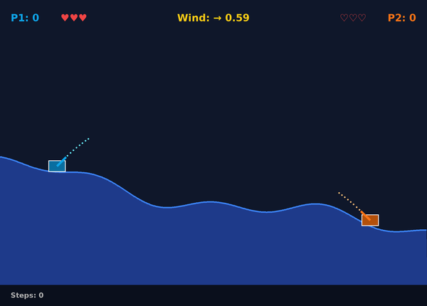 |

